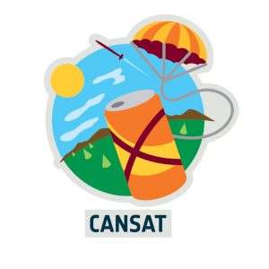

# 🛰️ Proyecto CanSat — Repositorio de Desarrollo

Este espacio está dedicado a la documentación, diseño y desarrollo progresivopara que el alumnado pueda participar en el concurso. Aquí encontrarás software, pruebas de sensores y las guías para la construcción e integración continua del sistema:

* **Hardware y Esquemas:** Diagramas de conexión y pruebas individuales de componentes.
* **software:** Código incremental para la lectura de sensores, calibración y control de vuelo.
* **Estación de Tierra:** Scripts para la recepción, procesamiento y visualización de la telemetría en tiempo real.
* **Documentación:** Explicaciones paso a paso sobre el proceso de montaje, pruebas y desarrollo de la misión.

## 📁 Actividades
### [📁 Project](./00activites/00ProjectManagment)
### [📁 Design](/00activites/01desing/)
### [📁 programming](./00activities/02programming)

## Referencias

* [CanSat desde cero (GitHub)](https://github.com/elena-alvarez/CanSat-desde-cero)

