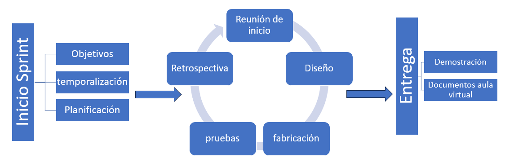

## 📌 Índice
- [Agile](#agile)
- [Backlog del Producto (CanSat)](#backlog-del-producto-cansat)
  - [1. Requisitos Técnicos y del Sistema](#1-requisitos-técnicos-y-del-sistema)
  - [2. Historias de Usuario](#2-historias-de-usuario)
- [Sprint 1](#sprint-1)
  - [Temporalización](#-temporalización)
  - [Objetivos del Sprint](#-objetivos-del-sprint)
  - [Backlog a Realizar](#-backlog-a-realizar)
  - [Backlog del Sprint (Desglosado en Tareas)](#%EF%B8%8F-backlog-del-sprint-desglosado-en-tareas)
- [CanSat IES GPB](#cansat-ies-gpb)
- [Referencias](#referencias)
  
# Agile

---

# Backlog del Producto (CanSat)

A continuación se muestra el listado estructurado de requisitos, características e historias de usuario que debe cumplir el sistema.

## 1. Requisitos Técnicos y del Sistema

1. **Estructura y Chasis**
   * Carcasa imprimible en 3D para albergar todos los componentes respetando las dimensiones específicas.

2. **Sistema de Retención en Caída (Paracaídas)**
   * **Velocidad de caída:** Entre 8 m/s y 12 m/s.
   * **Resistencia estructural:** Soportar una fuerza de hasta 50 N en el punto de unión entre el paracaídas y el chasis.

3. **Alimentación Autónoma**
   * **Autonomía:** Mínimo 4 horas de operación continua.
   * **Diseño:** Fácil acceso a la fuente de alimentación.
   * **Control:** Interruptor físico de encendido y apagado (ON/OFF).

## 2. Historias de Usuario

4. **Procesamiento de datos telemétricos**
   * **Descripción:** Como miembro del equipo de estación de tierra, quiero procesar los datos de presión atmosférica y temperatura registrados durante el vuelo en la PC para su posterior análisis.

5. **Documentación de competición**
   * **Descripción:** Como equipo, queremos preparar y entregar toda la documentación requerida por la organización para poder participar formalmente en el concurso.

6. **Plataforma colaborativa en la nube**
   * **Descripción:** Como miembro del equipo, quiero contar con un espacio en la nube donde todos los integrantes puedan crear, editar y consultar la documentación del proyecto.

7. **Desarrollo de la misión secundaria**
   * **Descripción:** Como equipo, queremos diseñar una misión secundaria para recopilar datos científicos específicos que aporten un valor añadido y propósito único al CanSat.

8. **Plan de difusión y patrocinio**
   * **Descripción:** Como equipo, queremos elaborar e implementar un plan de comunicación y patrocinio para dar visibilidad al proyecto y conseguir el apoyo necesario.
  
# Sprint 1

## 📅 Temporalización
* **Fecha de inicio:** 3 de octubre
* **Fecha de finalización:** 25 de octubre

## 🎯 Objetivos del Sprint
* Tener un modelo 3D de la carcasa del CanSat.
* Tener un entorno de trabajo que permita a todos los miembros del equipo crear y visualizar toda la información del proyecto.
* Documentar el proceso de diseño 3D y parte de la planificación.

## 📋 Backlog a Realizar
1. **Carcasa imprimible en 3D** que albergue todos los componentes con dimensiones específicas.
5. **Presentar los documentos** necesarios para poder concursar.
6. **Tener un lugar en la nube** en el que todos los miembros del equipo puedan crear y consultar la información.

> 💡 **Nota:** No es indispensable que se termine una historia o backlog de producto en un solo Sprint; puede realizarse una parte.

---

## 🛠️ Backlog del Sprint (Desglosado en Tareas)

### 🔹 6. Tener un lugar en la nube en el que todos los miembros del equipo puedan crear y consultar la información
- [ ] **6.1.** Crear un equipo de trabajo y rellenar la tarea de elección de grupos del CanSat del aula virtual. *(Tarea aula)*
- [ ] **6.2.** Crear una carpeta en Drive (`@iesgpb.net`) y dar acceso a todos los miembros del grupo y al profesor como editores. *(Tarea aula)*
- [ ] **6.3.** Crear un tablero en Kanban (Trello) con las columnas necesarias y dar acceso a los miembros del equipo y al profesor. *(Tarea aula)*
- [ ] **6.4.** Planificar el sprint y subirlo. *(Tarea aula)*

### 🔹 1. Carcasa imprimible en 3D que albergue todos los componentes con dimensiones específicas
- [ ] **1.1.** Modelo 3D de Arduino.
- [ ] **1.2.** Modelo 3D del resto de componentes (sensor de temperatura/presión, módulo de radio y pila 9V).
- [ ] **1.3.** Modelo 3D de la carcasa con todos los componentes en su interior.

### 🔹 5. Presentar los documentos necesarios para poder concursar
- [ ] **5.1.** Crear la plantilla del documento PDR. *(Tarea aula)*
- [ ] **5.2.** Documentar una planificación del proyecto basada en metodologías ágiles. Fijar los sprints hasta el lanzamiento del proyecto.
- [ ] **5.3.** Documentar el proceso de diseño de la carcasa mediante modelos 3D.

### 🔹 8. Crear un plan de difusión y patrocinio del proyecto
- [ ] **8.1.** Lluvia de ideas sobre el plan de difusión.
- [ ] **8.2.** Lluvia de ideas sobre el plan de patrocinio del proyecto.

## CanSat IES GPB

Repositorio del proyecto Cansat

## Referencias

* [CanSat desde cero (GitHub)](https://github.com/elena-alvarez/CanSat-desde-cero)

